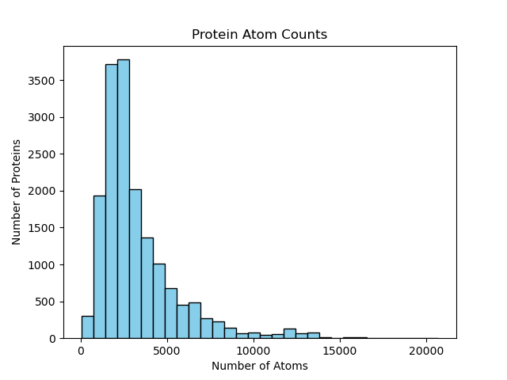

# Improving Protein Representations through Temporal GNN of MD Simulations

## Installation instructions

First create a conda environment with python 3.11.12.

```bash
bash install.sh
```

## To run a model, go into the folder of that model and run:

```
python3 dynamic_model_main.py
```

## Structure of the Repo:
```
├── imgs
│   └── Protein_Atom_Counts_Histogram.png
├── install.sh
├── README.md
├── Task_1_Data_Processing
│   ├── gnn_utils.py
│   ├── md_datasets.py
│   ├── md_out.py
│   ├── misato-dataset
│   ├── README.md
│   └── save_data.py
├── Task_2_Data_Processing
│   ├── add_atom_residue_number.py
│   ├── add_binding_site_labels.py
│   ├── decompress_topology.sh
│   ├── gnn_utils.py
│   ├── h5_to_traj.py
│   ├── install.sh
│   ├── md_datasets.py
│   ├── md_out.py
│   ├── misato-dataset
│   ├── README.md
│   └── save_data.py
├── Task1
│   ├── misato-dataset
│   ├── models.py
│   ├── T1-GCRN-Aug 
│   │   ├── best_model.pth
│   │   ├── dynamic_model_main.py
│   │   ├── gnn_utils.py
│   │   └── md_datasets.py
│   ├── T1-GCRN-Basic
│   │   ├── best_model.pth
│   │   ├── dynamic_model_main.py
│   │   ├── gnn_utils.py
│   │   └── md_datasets.py
│   ├── T1-GCRN-EGNN 
│   │   ├── best_model.pth
│   │   ├── dynamic_model_main.py
│   │   ├── gnn_utils.py
│   │   └── md_datasets.py
│   ├── T1-GCRN-S4 
│   │   ├── best_model.pth
│   │   ├── dynamic_model_main.py
│   │   ├── gnn_utils.py
│   │   └── md_datasets.py
│   ├── T1-ROLAND-EGNN
│   │   ├── best_model.pth
│   │   ├── dynamic_model_main.py
│   │   ├── gnn_utils.py
│   │   └── md_datasets.py
│   ├── T1-ROLAND-GCN 
│   │   ├── best_model.pth
│   │   ├── dynamic_model_main.py
│   │   ├── gnn_utils.py
│   │   └── md_datasets.py
│   ├── T1-Static 
│   │   ├── best_model.pth
│   │   ├── gnn_utils.py
│   │   ├── md_datasets.py
│   │   └── dynamic_model_main.py
│   └── T1-Static-Transfer 
│       ├── best_dynamic_model.pth
│       ├── best_model.pth
│       ├── dynamic_model_main.py
│       ├── gnn_utils.py
│       ├── md_datasets.py
│       └── test.py
└── Task2
    ├── misato-dataset
    ├── models.py
    ├── T2-GCRN
    │   ├── best_model.pth
    │   ├── dynamic_model_main.py
    │   ├── gnn_utils.py
    │   └── md_datasets.py
    ├── T2-ROLAND
    │   ├── best_model.pth
    │   ├── dynamic_model_main.py
    │   ├── gnn_utils.py
    │   └── md_datasets.py
    ├── T2-Static
    │   ├── best_model.pth
    │   ├── dynamic_model_main.py
    │   ├── gnn_utils.py
    │   └── md_datasets.py
    └── T2-Static-Transfer
        ├── best_dynamic_model.pth
        ├── best_model.pth
        ├── dynamic_model_main.py
        ├── gnn_utils.py
        └── md_datasets.py
```

